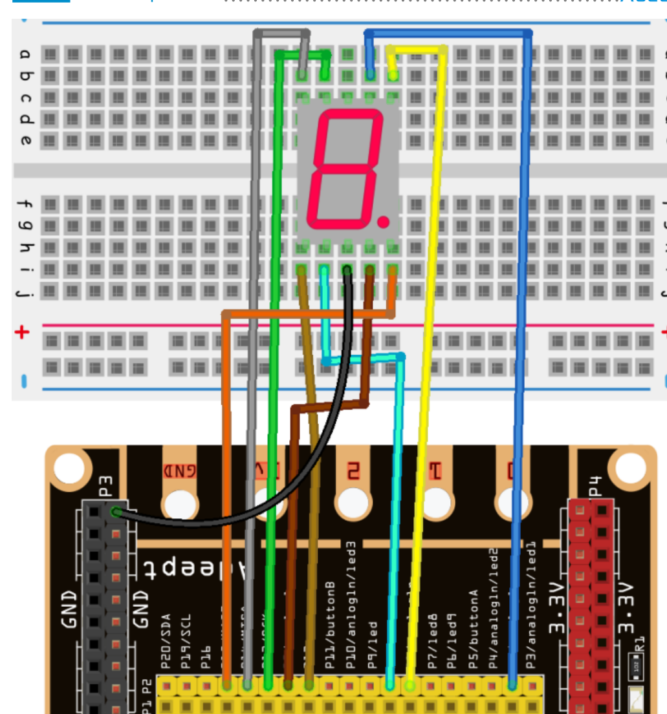

# Makecode Extension Kit

Adeept digital tube kit for makecode



  
## Examples:

The file test.ts, which uses most of the blocks in this extension. 

```
basic.forever(function () {
   let index = 0
    for (index; index < 9; index++) {
        Freenove.Show_digit(index)
        basic.pause(500)
    }

})
```
In this example, digital tube displays numbers 0-9.
## License

MIT

## Supported targets

* for PXT/microbit
